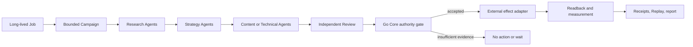

# GTM Pack: Auditable Agent Operations

## Category

**Agent Workflow** is an open-source, auditable control plane for context-bound Agent work.

It sits between a human-owned mission and interchangeable Agent providers. The Core turns a long-lived Job into bounded Campaigns, immutable Workflow DAGs, exact Node Context, capability limits, approvals, receipts, and Replay.

It is not a chatbot builder, connector marketplace, prompt library, or SEO-specific runtime.

## One-line pitch

> Build a digital Agent workforce whose context, permissions, work, approvals, and outcomes can be inspected and replayed.

## Thirty-second pitch

Most Agent systems make it easy to call a model but difficult to prove what it knew, what it was allowed to do, why it acted, and whether a retry repeated an external effect. Agent Workflow provides the missing control plane. Humans define Jobs, admit bounded Campaigns, pin versioned Workflows, and give every Node an exact Context Bundle and Capability Manifest. The Go Core validates outputs and records every accepted transition as a hash-bound Receipt and Replay.

Provider Agents remain replaceable. Canonical authority does not.

## Product language

| Product term | Market meaning | What it is not |
| --- | --- | --- |
| Job | A long-lived business mission | A running Agent |
| Campaign | One bounded attempt to advance the Job | A permanent bot |
| Workflow | A versioned operating playbook | An editable live execution |
| Agent Role | A reusable digital job description | A model or process count |
| Agent Invocation | One measured attempt by an Agent Role | A persistent employee |
| Context Bundle | The exact evidence the Agent receives | An unbounded project folder |
| Capability Manifest | The exact tools and effects available | A prompt asking the Agent to behave |
| Receipt and Replay | Auditable proof of accepted work | A provider transcript treated as truth |

The safe workforce claim is therefore **“13 specialized Agent Roles”**, not “13 models running continuously.” Runtime claims must use actual Invocation receipts.

## SEO Ops vertical: a 13-Agent digital SEO team

SEO Ops is a separate commercial product and the first real-world dogfood source for the open-source Core. Its current registry contains 13 unique Agent Roles, reused across versioned Workflow Nodes:

### Search and market intelligence

1. **SERP Intent Analyst** — validates query intent and the competitive result shape.
2. **Competitor Organic Footprint Analyst** — identifies real organic-search competitors.
3. **Competitor Content Cluster Analyst** — analyzes competitor topic and page coverage.
4. **Content Coverage Analyst** — finds gaps between owned pages, queries, and required evidence.

### Strategy and prioritization

5. **Keyword Opportunity Mapper** — turns evidence into a structured opportunity map.
6. **Opportunity Prioritization Agent** — ranks bounded opportunities against the Job.
7. **SEO Mutation Decision Agent** — chooses an allowed change or a typed `no_action` result.

### Content production

8. **Existing Page Content Agent** — drafts approved changes to an existing page.
9. **Greenfield Content Planner** — defines the evidence-bound plan for a new page.
10. **Greenfield Content Writer** — drafts content against the approved plan.

### Independent quality

11. **Independent Content Reviewer** — reviews another Agent's draft against evidence and contract. The writer does not approve its own work.

### Technical SEO

12. **Technical SEO Auditor** — identifies crawl, indexability, canonical, schema, and delivery defects.
13. **Technical Remediation Planner** — converts verified defects into bounded repair packages.

The positioning line is:

> SEO Ops deploys a 13-Agent digital SEO team across search intelligence, strategy, content, independent review, and technical SEO—coordinated by an auditable Go control plane.

## How the team works



The Agents perform bounded judgment. Deterministic code owns scheduling, freshness, budgets, idempotency, authorization, canonical mutation, and Replay.

## Current dogfood proof

As of 2026-08-30, Kinmed has begun a 200-hour evidence window:

- 4 long-lived scheduled Jobs;
- 4 commercial keyword clusters;
- 30 canonical keywords;
- Portfolio evaluation every 6 hours;
- GSC synchronization daily;
- human-readable and JSON evidence reports every 48 hours;
- SERP/DataForSEO evidence reused for 14 days before refresh;
- Restate Request/Response runtime over HTTP/1.1;
- exact baseline and end timestamps for delta reporting.

The baseline proves that the system is installed, scheduled, healthy, and fail-closed. It does **not** yet prove ranking or CTR improvement. At the baseline, no new Agent Invocation was due because current evidence had not crossed the automatic opportunity gates. That is a valid operational result: the system waited instead of manufacturing work.

At the end of the window, the case study should report:

- Agent Roles available and Roles actually invoked;
- Invocation count, retries, model usage, and wall time;
- Context refreshes and external evidence API calls;
- Campaigns started, completed, blocked, or concluded `no_action`;
- pages and keyword clusters analyzed or changed;
- approvals, external effects, public readbacks, and rollback evidence;
- GSC baseline and due measurement deltas;
- every metric linked to canonical Receipts rather than a marketing estimate.

## Open-source Core status

The domain-neutral Core is already implemented on `main`:

- closed v1 JSON Schema with generated Go and TypeScript bindings;
- Job, Campaign, immutable Workflow DAG, and Node contracts;
- Context compiler, producer registry, freshness and provenance validation;
- Capability Manifest and bounded budgets/deadlines;
- canonical Campaign execution and crash-durable FileLedger;
- preview/confirm admission and human approval receipts;
- exact-cutoff Replay and redacted public projections;
- cross-Campaign Change Cases, conflict sets, resolution, mutation lease, apply, and readback;
- provider isolation and normalized Agent Runner protocol;
- bundled bridges for Codex, Claude Code, Pi, OpenClaw, and Hermes;
- local Control Plane GUI covering Jobs, Campaigns, Runs, Context, Approvals, Change Cases, Providers, and Audit;
- experimental audited WebMCP adapter;
- deterministic generic and SEO-shaped conformance fixtures.

`v0.1.0` contains the public conformance release. Current `main` additionally contains the complete Control Plane GUI merged in PR #27, so the next public release should version the current mainline rather than describe the GUI as unreleased source work.

## What has already been extracted

The following are now generic contracts, not SEO concepts:

1. **Job / Campaign / Workflow / Node** — mission, bounded attempt, playbook, and smallest authority boundary.
2. **Context Pack / Context Bundle** — immutable, scoped, fresh, provenance-bound Agent knowledge.
3. **Capability Manifest** — exact side-effect authority for one Node Invocation.
4. **Executor Profile** — provider, version, model/config, isolation, and configuration hash.
5. **Action Artifact** — a proposed decision or mutation without automatic authority.
6. **Admission and Approval Receipts** — exact preview/confirm decisions bound to revision and hashes.
7. **Campaign execution receipt chain** — reservation, context, invocation, provider result, terminal state, and recovery.
8. **Replay** — verified projection of an exact receipt prefix.
9. **Resource Ref / Change Proposal / Change Case** — generic cross-Campaign coordination and conflict resolution.
10. **Mutation Lease and readback** — bounded external effect execution without duplicate authority.
11. **Agent Runner Provider protocol** — replaceable provider adapters behind one normalized execution seam.
12. **Control Plane Snapshot and GUI** — canonical read model; the browser does not invent business state.
13. **Conformance Report** — deterministic proof that a vertical consumer obeys the public contracts.

## What should be extracted next

### 1. Agent Role Catalog v1

Today SEO Ops counts roles from unique executor references. Add a small, non-authoritative metadata contract that gives each executor reference a stable Role ID, human title, purpose, expected Context categories, output categories, and version/hash. It must compile into or annotate existing Node contracts; it must not create another execution authority.

This makes “13 Agent Roles” mechanically countable and gives the GUI a reusable workforce view.

### 2. Evidence Window and Workforce Report v1

Generalize the Kinmed 200-hour marker into a report contract containing:

- exact start/end and baseline hash;
- admitted Jobs and Campaigns;
- available versus invoked Agent Roles;
- Context refresh, Invocation, approval, effect, readback, and outcome counts;
- canonical Receipt and Replay references.

Markdown, HTML, charts, and case-study copy should remain deterministic views of that JSON report.

### 3. Commercial-product boundary

Keep SEO Ops and Agent Workflow as different products with different roadmaps, positioning, and release rights. SEO Ops may consume tagged Core contracts where that reduces duplicated infrastructure, but its commercial runtime, workflows, integrations, data products, and customer experience remain private product capabilities.

Only a deliberately selected, domain-neutral contract should move upstream. The extraction must be useful without SEO Ops and must arrive with synthetic conformance evidence rather than private project data. SEO Ops should not become a public plugin bundle or a fork that must track the open-source repository file for file.

The dependency direction remains:

```text
SEO Ops commercial product --selective extraction--> Agent Workflow open-source Core
SEO Ops commercial product <--tagged contracts------ Agent Workflow open-source Core
```

This is shared learning, not shared product identity.

### 4. Release the current mainline

Cut the next semver release after the Role Catalog and Workforce Report contracts, or release the existing GUI mainline first and put those contracts into the following minor release. Do not leave the public README describing capabilities newer than the latest tag without a clear version label.

## What stays in SEO Ops

Do not move these into the Core:

- GSC, GA4, SERP, DataForSEO, crawling, CMS, and public-release adapters;
- keyword clusters, Page Cases, SEO opportunity scoring, content density, schema, and technical SEO rules;
- Day 7/14/28 SEO measurement policy;
- the 13 SEO Agent Role definitions and SEO Workflow library;
- SEO-specific Operating Products and reports;
- Kinmed and Muriersilk project data.

The open-source Core demonstrates how governed Agent work can run. SEO Ops owns the commercial SEO operating system: what work matters, how it is automated, which integrations perform it, and how customers receive measurable value.

## Claim ladder

| Stage | Safe claim |
| --- | --- |
| Implemented | “The platform defines 13 specialized SEO Agent Roles.” |
| Invoked | “X of 13 Roles performed Y canonical Invocations.” |
| Delivered | “Those Invocations produced Z accepted artifacts across N pages or clusters.” |
| Released | “M changes crossed approval, apply, and public readback.” |
| Measured | “Due GSC measurements showed the following attributed or inconclusive deltas.” |

Never collapse those five stages into “13 Agents improved SEO.”

## Distribution package

The public launch should contain:

1. a 90-second Control Plane demo using the generic fixture;
2. the SEO-shaped conformance fixture showing a real vertical without private data;
3. a Provider matrix for Codex, Claude Code, Pi, OpenClaw, and Hermes;
4. the 13-Agent SEO team diagram as the vertical story;
5. the Kinmed 200-hour evidence report after the window closes;
6. copyable commands that validate, run, inspect, and replay one Campaign locally.

The developer message is simple:

> Bring your own Agent provider and vertical expertise. Agent Workflow supplies the contracts, control plane, receipts, and Replay needed to operate it responsibly.
